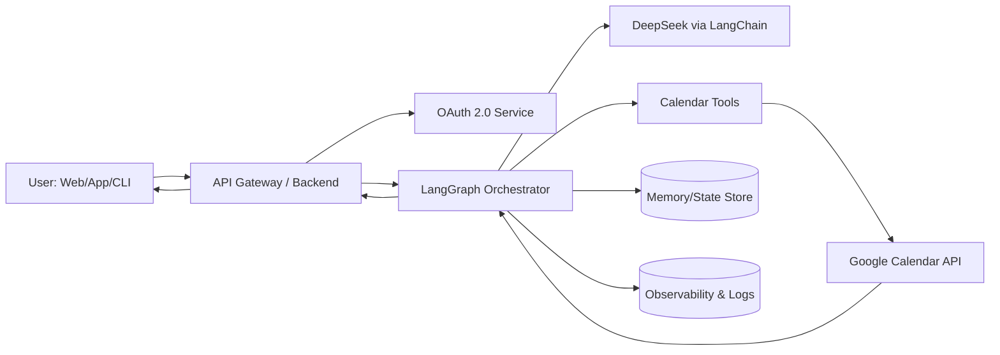
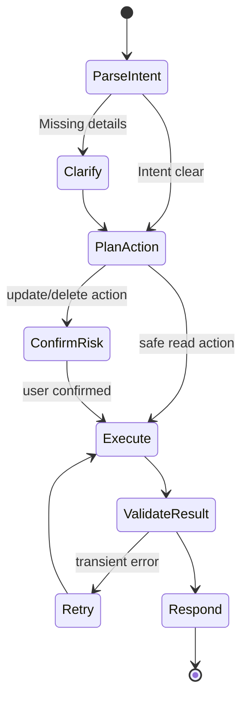

# Google Calendar Agent

An advanced AI agent project that helps you manage Google Calendar using natural language.

This project is designed for real-world use with:
- **DeepSeek AI** as the LLM brain
- **LangChain** for tool orchestration and integrations
- **LangGraph** for stateful, multi-step agent workflows
- **Google Calendar API** for secure calendar operations

---

## What This Project Does

The Google Calendar Agent can:
- Create events from natural language prompts
- Update and reschedule existing events
- Cancel events safely with confirmation
- List upcoming events with smart summaries
- Suggest best meeting slots
- Handle follow-up conversation context

Example prompts:
- "Schedule a team sync tomorrow at 4:00 PM."
- "Move my 5 PM meeting to 6:30 PM."
- "What is on my calendar for next Monday?"
- "Find a 30-minute free slot between 2 and 6 PM."

---

## Why This Project (Real-World Focus)

Most demo agents stop at simple Q&A.  
This project focuses on production-style concerns:
- Stateful workflow control (not just single-shot calls)
- Tool reliability and fallback handling
- Confirmation steps for destructive actions
- Structured logs and observability
- Easy extension for CRM, Slack, Email, and more

---

## Core Tech Stack

### AI + Agent Layer
- **DeepSeek** (chat/completion model)
- **LangChain** (tool calling, prompt templates, memory adapters)
- **LangGraph** (agent state machine, branching, retries, guardrails)

### Integration Layer
- **Google Calendar API**
- **Google OAuth 2.0**

### Backend (recommended)
- **Node.js** + **TypeScript**
- **Express** or **Fastify**

### Data + Infra (recommended)
- **Redis** (short-term memory, cache, queues)
- **PostgreSQL / MongoDB** (user, sessions, logs)
- **Docker** (deployment consistency)

---

## High-Level Architecture (Visual)



---

## Agent Workflow (Visual)



---

## Recommended Project Structure

```text
.
├── apps/
│   ├── api/                      # Backend API service
│   └── web/                      # Optional frontend dashboard
├── packages/
│   ├── agent-core/               # LangGraph workflows + agent logic
│   ├── integrations-google/      # Calendar API + OAuth helpers
│   ├── prompts/                  # Prompt templates
│   └── shared/                   # Shared types, constants, utils
├── infra/
│   ├── docker/
│   └── monitoring/
├── .env.example
├── docker-compose.yml
└── README.md
```

---

## Setup Guide

## 1) Clone

```bash
git clone https://github.com/your-username/google-calendar-agent.git
cd google-calendar-agent
```

## 2) Install Dependencies

```bash
npm install
```

## 3) Configure Environment

Create `.env` in root:

```env
# App
NODE_ENV=development
PORT=5000

# DeepSeek
DEEPSEEK_API_KEY=your_deepseek_api_key
DEEPSEEK_MODEL=deepseek-chat

# Google OAuth
GOOGLE_CLIENT_ID=your_google_client_id
GOOGLE_CLIENT_SECRET=your_google_client_secret
GOOGLE_REDIRECT_URI=http://localhost:5000/auth/google/callback

# Calendar
GOOGLE_CALENDAR_ID=primary
DEFAULT_TIMEZONE=Asia/Kolkata

# Storage
DATABASE_URL=your_database_url
REDIS_URL=redis://localhost:6379
```

## 4) Google Cloud Configuration

1. Create a project in Google Cloud Console  
2. Enable **Google Calendar API**  
3. Configure OAuth Consent Screen  
4. Create OAuth credentials (Web application)  
5. Add redirect URI from your `.env`  

## 5) Run Development Server

```bash
npm run dev
```

---

## Example API Contract

### POST `/api/agent/chat`

Request:

```json
{
  "userId": "user_123",
  "message": "Schedule product demo tomorrow at 3 PM for 45 minutes with Rahul"
}
```

Response:

```json
{
  "status": "success",
  "intent": "create_event",
  "result": {
    "eventId": "abc123",
    "title": "Product demo with Rahul",
    "start": "2026-04-15T15:00:00+05:30",
    "end": "2026-04-15T15:45:00+05:30"
  },
  "message": "Done. I scheduled it on your primary calendar."
}
```

---

## Safety and Guardrails

- Confirm before delete/cancel operations
- Validate date/time and timezone before writing events
- Log all tool actions with request IDs
- Graceful retries for temporary API failures
- Role-based access controls for team environments

---

## Roadmap

- Multi-calendar support (work/personal/resource calendars)
- Recurring event intelligence
- Meeting conflict auto-resolution
- Email + Slack notification hooks
- Voice input + multilingual command support
- Admin analytics dashboard

---

## Contributing

1. Fork this repository
2. Create a feature branch (`git checkout -b feature/your-feature`)
3. Commit your changes (`git commit -m "Add your feature"`)
4. Push your branch (`git push origin feature/your-feature`)
5. Open a Pull Request

---

## License

MIT License

---

## Author Note

Built for advanced, real-world AI agent engineering.  
If you want, I can also generate:
- complete backend boilerplate,
- LangGraph workflow starter code,
- DeepSeek + Google Calendar integration scaffolding,
- and deployment setup (Docker + cloud).
